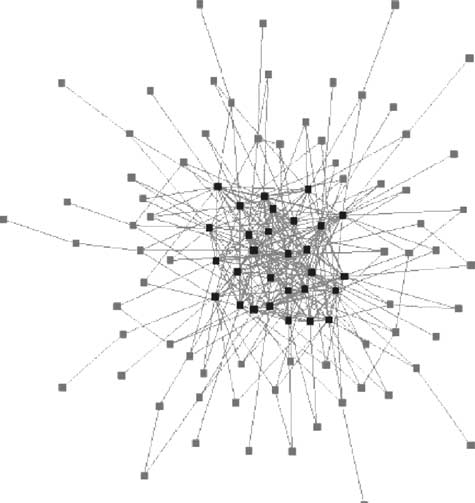
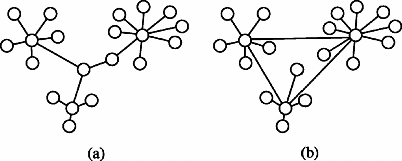

**voca**
* **path** : 네트워크에서 되돌아가는 일 없이 계속해서 한 방향으로 따라갈 수 있는 arc의 배열(같은 노드를 거듭 거치지 않은 이어진 링크의 배열)
* **arc** : 방향성 링크를 말함.

# 2.1 노드 간의 유사성.

연결된 노드들은 종종 비슷한 성질을 갖는 경향이 있다. 이러한 경향을 **assortativity**라고 한다. 

assortativity는 소셜 자주 나타나는 현상이며, 예를 들면 비슷한 사람들끼리 모이게 되는 현상을 **동종선호**(homophily)라 한다. 

참고로 이러한 homophily는 소셜 네트워크에서 자신과 다른 개체를 배제시키고 자신의 집단에서 말하는 바가 진실이라고 믿고, 믿음을 강화하게 하는 **echo chamber**에 갖히게 될 수 있다.

assortativity는 소셜 네트워크에 국한하지 않고 많은 네트워크에서 공유하는 성질인데, 예를 들면 네트워크 노드의 degree에 기반한 assortativity가 있고 이를 **degree assortativity**(degree correlation)이라고 한다.

degree assortativity는 2가지 형태로 나타나는데

1. assortative :  degree가 큰 노드가 degree가 큰 노드들과 자주 연결되고, degree가 작은 노드들은 degree가 작은 노드들끼리 연결되는 경향. 코어 주변부 구조(core periphery structure)를 가진다.
    

2. disassortative : degree가 큰 노드가 degree가 작은 노드가 연결되는 네트워크의 형태를 의미한다. 이류적 네트워크(disassortative network)에서 허브 노드들은 별 모양 덩어리의 중심에 자리한다.
    

> 네트워크의 degree assortativity를 측정하는 두 가지 방법이 있다. 두 방법 모두 이웃하는 노드의 연결선 수 사이의 상관관계(correlation)측정에 기반한다. 두 변수 중 한 변수의 큰 값이 다른 변수의 큰 값에 대응하는 경향이 있을 때, 두 변수는 양의 상관관계를 갖는다.(_visa versa_) 피어슨 상관계수(Pearson's correlation coefficient)는 상관관계를 측정하는 잘 알려진 방법이다. $-1~1$사이의 값을 갖고, $0$일 경우 상관관계가 없는 것이다. 동류성 계수(assortativity coefficient)가 양수이면 네트워크는 assortative이고, 반대는 disassortative 하다. 두 번째 방법은 노드 $i$의 이웃의 평균 연결선 수를 측정하는 것에 기반한다.
> $$k_{nn}(i) = \frac{1}{k_i}\sum_ja_{ij}k_j$$
> 여기서 노드 $i,j$가 서로 이웃이면 $a_{ij}$는 $1$이고 아닐 경우 $0$이다. 다음으로 degree가 $k$인 모든 노드의 $k$ 가장 가까운 이웃 함수 $\langle k_{nn}(k) \rangle$를 degree 수가 k인 모든 노드의 $k_{nn}(i)$의 평균으로 정의한다. 만약 $\langle k_{nn}(k) \rangle$가 degree $k$의 증가 함수라면, degree가 큰 노드들은 연결선 수가 큰 노드들과 연결되는 경향이 있으며 네트워크가 assortative함을 의미한다. 만약 $\langle k_{nn}(k) \rangle$가 감소 함수라면, 네트워크는 이류적이다.(글을 참 난해하게 써 놨다...)

요약하자면 

* $k_{nn}(i)$ : 노드 $i$의 이웃 노드의 degree 평균
* $\langle k_{nn}(k) \rangle$ : degree가 $k$인 노드들의 $k_{nn}(x)$ 의 평균.

# 2.2 경로와 거리

Path는 가로지르는 링크의 배열이다. 경로를 이루는 링크의 수를 **경로 길이**(path length) 라고 한다. path는 여러개가 있을 수 있다.

**cycle**은 src 와 target 노드가 같은 특별한 형태의 경로다.
**simple path**(단순 경로)는 같은 링크를 두 번 다시 지나지 않는다. 이 책의 중점은 simple path 이다.

경로의 개념은 네트워크에서 노드 사이의 **distance**(거리)를 정의하는 기초가 된다. 두 노드 사이의 최소 개수의 링크를 가로지르는 path를 **shortest path**(최단 경로)라고 부르며, 이 경로의 길이를 **shortest path length**라고 한다. 

만일 링크에 가중치가 있다면, path를 링크 가중치 배열의 합으로 표현할 수 있다. 이 때 shortest path length를 역수를 취함으로써 높은 가중치를 가지는 path를 조사 할 수 있다.

최단 경로의 길이를 노드 간 거리의 측정량으로 사용해 전체 네트워크의 총 거리를 정의할 수 있다. **average shortest-path length**는 네트워크의 모든 노드 쌍 사이의 최단 경로의 길이를 평균해 얻을 수 있다. 네트워크의 **diameter**(지름)은 네트워크의 모든 노드 쌍 사이의 최단 경로 길이 중 최대값이다.

> 수학적으로 방향성과 가중치가 없는 네트워크에서 **average shortest-path length**는 다음과 같이 정의할 수 있다.
> $$\langle l \rangle = \frac{\sum_{i < j}l_{ij}}{N \choose 2} = \frac{2\sum_{i < j}l_{ij}}{N(N - 1)}$$
> 여기서 $l_{ij}$는 노드 $i, j$사이의 최단 경로의 길이이며, $N$은 노드 수다. 모든 노드 쌍에 대한 shortest-path length 를 전체 노드 쌍의 개수로 나눈 것이 $\langle l \rangle$이다. 
> 방향성이 있을 경우에는 아래와 같다.
> $$\langle l \rangle = \frac{\sum_{i \ne j}l_{ij}}{N \choose 2} = \frac{\sum_{i \ne j}l_{ij}}{N(N - 1)}$$
> diameter는 다음과 같다.
> $$l_{max} = \max_{ij}l_{ij}$$

average shortest-path length와 diameter의 정의는 각 노드 쌍에 대해 shortest-path length가 잘 정의되어 있다고 가정한다. **만약 어떤 노드 쌍 사이에 경로가 없다면, 평균 경로 길이와 잘 정의되지 않는다.**

경로가 없는 경우는 무한대의 거리를 가진 경로로 간주 할 수 있다. 이런 상황을 다루는 방법이 있다.

> 만약 경로가 없을 때, 방향이 없는 네트워크의 평균 경로 길이를 정의하고 싶다면 다음 공식을 사용할 수 있다.
> $$\langle l \rangle = \left( \frac{\sum_{i < j}1/l_{ij}}{N \choose 2} \right)^{-1}$$
> 만약 노드 $i,j$사이에 경로가 없다면 $l_{ij} = \infty$임으로 $1/\infty = 0$으로 정의된다. 방향성 네트워크도 동일한 방법으로 평균 경로 길이를 구할 수 있다.

average shortest-path length와 diameter 중에 이 책에서는 전자를 사용한다. 비록 average shortest-path length가 diameter를 넘을 수는 없지만 일반적으로 network가 커질 때 같이 커지는 경향이 있어 때때로 네트워크의 거리를 젤 때 같은 의미로 사용하는 경우가 있다.

# 2.3 연결상태와 덩어리

네트워크의 구조와 기능을 관련지으려면, 네트워크의 **연결상태**(connectedness)를 고려하는 것이 유용하다.

density가 높을수록 네트워크가 연결된 가능성이 높고, 그렇지 않을 경우 네트워크가 단절될 가능성이 크다. 

네트워크가 서로 연결되지 않았다면 네트워크가 **단절됐다**(disconnected)고 한다. 단절된 네트워크는 둘 이상의 **연결된 덩어리**(connected component)혹은 줄여서 **덩어리**(component)로 이뤄져 있다. 

component란 하나 이상의 노드를 포함한 서브네트워크를 의미한다.

많은 실제 네트워크에서 가장 큰 component가 네트워크의 상당부분을 차지하며 이를 giant component라고 부른다. 만일 모든 노드 쌍에 하나 이상의 path가 존재하면 네트워크 전체가 giant component이다. 

방향성이 있는 네트워크에서는 component를 다루기가 까다로운데, 방향성이 있는 네트워크를 마치 방향성이 없는 네트워크처럼 다루는 대신 실제 path가 있느냐 없느냐를 따져, 방향성은 맞지 않으나 방향성을 고려하지 않았을 때 path가 존재 component를 **약하게 연결된 덩어리**(weakly connected component)라고 한다. 

방향성이 있는 component 에서 방향을 고려하고도 서로 도달 가능한 링크가 존재하는 component를 **강하게 연결된 덩어리**(strongly connected component)라고 한다.

네트워크가 단절 된 상태의 네트워크의 거리 측정은 두가지 방법이 있다.

1. giant component의 거리만 고려한다.
2. component들의 평균 거리를 계산한다.

단절된 네트워크의 지름을 구하기 위해 각 component의 지름을 구해 최대값을 취할 수 있다.

방향성 네트워크에서 $S$를 **strongly connected component**라고 했을 때, $S$로 접근 가능한 노드 집합과 $S$로 부터 접근 불가능한 노드의 집합을 식별할 수 있다. 

* $S$에서 도달 가능한 집합을 **in-component** 라 한다.
* $S$에서 도달 불가능한 집합을 **out-compoent**라 한다.

만일 네트워크 전체가 **strongly connected component**라면 네트워크가 강하게 연결되어 있다고 한다. 방향성 네트워크 전체가 **weakly connected component**라면 네트워크가 약하게 연결되어 있다고 한다.

# 2.4 트리

**트리**는 아무 링크 하나를 삭제하면 2개의 component로 쪼개지는 특수한 형태의 방향성이 없는 네트워크이다.

> 트리의 링크 수는 $L = N - 1$이다. 노드를 하나 추가할 때 마다 링크는 하나씩만 늘어난다.

# 2.5 최단 경로 찾기

원천 노드에서 시작해 네트워크의 다른 모든 노드 사이의 최단 경로를 찾는 알고리즘 혹은 절차를 **너비우선 탐색**(breadth first search)라고 한다. 너비 우선 검색 탐색 알고리즘은 링크의 부분집합만 포함하는 방향이 있는 **최단 경로 트리**(shortest path tree)를 구축한다.

>  너비 우선 탐색  
>
> root 노드를 $s$라고 했을 때, $s$는 frontier에서 대기한다. $s$의 거리는 $l(s, s) = 0$으로 설정되며 다른 모든 노드의 거리는 공통의 비현실적 값으로 (-1)로 설정된다. 궁극적으로 최단 경로 트리가 될 네트워크는 링크 없이 시작한다. 
> 각 반복 시 미개척지의 다음 노드 $i$ 의 후속 노드 $j$의 거리가 이미 설정되지 않았다면 다음 세 단계를 따른다. 
>
> 1. 노드 $j$는 frontier에서 대기한다.
> 2. $s$에서 노드 $j$의 거리를 $l_{s,j} = l_{s, i} + 1$로 설정한다.
> 3. 노드 $i$에서 $j$로 방향이 있는 링크 하나를 최단 경로 트리에 추가한다.
>
> frontier가 비게 되면 절차를 종료한다. 종료 후에 거리가 설정되지 않은 노드가 있다면, 이들은 원천 노드에서 도달 가능하지 않으며 네트워크의 다른 component에 있어야 한다.

# 2.6 사회적 거리

에르되시 수 : 팔 에르되시 중심 공동 저자 네트워크에서 자신과 팔 에르되시까지의 가장 짧은 거리를 의미함. 에르되시는 공동저자가 많아서 생가보다 짧은 에르되시 수를 가진 사람들이 많다.

# 2.7 여섯 단계 분리

> 평균 경로 길이가 네트워크 크기에 따라 느려게 커지는 것을 수학적으로는 평균 경로 길이가 네트워크 크기에 대해 로그적으로 증가하는 것으로 나타낼 수 있다. 
>
> $$\langle l \rangle = \log{N}$$

# 2.8 친구의 친구

노드의 이웃 노드 사이의 연결은 이 노드끼리 얼마나 긴밀하게 연결됐는지 혹은 **뭉쳐**있는지를 포착하기 때문에 네트워크 국소 구조의 중요한 특징이다. 

노드의 **clustering coefficient**(뭉침 계수)는 노드의 이웃 노드들의 쌍 중에서 서로 연결된 쌍의 비율이다. 이는 노드를 실제로 포함하는 삼각구조의 수와 노드가 참여 할 수 있는 삼각 구조의 최대 개수의 비율과 같다.

> 노드 $i$의 **clustering coefficient**는 수학적으로 다음과 같이 정의된다.
> $$C(i) = \frac{\tau(i)}{\tau_{\max}(i)} = \frac{\tau(i)}{2 \choose k_i} = \frac{2\tau{i}}{k_i(k_i - 1)}$$
> 여기서 $\tau(i)$는 노드 $i$를 포함하는 삼각구조의 수다. 노드 $i$가 최대로 참여할 수 있는 삼각구조의 수는 노드 $i$의 $k_i$이웃들로 만들어지는 노드 쌍의 수다. 분모의 $k_i$항과 $(k_i - 1)$항 때문에 $C(i)$는 오직 노드 $i$의 degree가 $k_i > 1$일 때만 정의될 수 있다. 즉, 노드가 삼각구조를 만들려면 최소한 2개의 이웃이 있어야 한다.
>
> 전체 네트워크의 뭉침 계수는 개별 노드 뭉침 계수의 평균이다.
> $$C = \frac{\sum_{i:k_i>1}C(i)}{N_{k> 1}}$$
> 평균 뭉침 계수를 계산 할 때, 연결선 수가 $k < 2$인 노드들은 제외한다.

clustering coefficient는 방향성이 없는 네트워크에서만 적용된다.

방향성 네트워크에서 뭉침 계수를 정의를 확장 할 수 있지만, 특정 사례와 관련이 있는 삼각구조의 종류에 따라 정의한다.(E.g., a가 b를 follow 하고, b가 c를 follow 한다면 a,b를 통한 c의 리트윗을 보기보다 c의 트윗을 집적 보고 싶을 수도 있다. 이럴 경우 **지름길**을 나타내는 방향이 있는 삼각구조만 세고 싶을 수 있다.)

온라인 소셜 네트워크들은 삼각구조 형성을 기반으로 추천한다.

이분 네트워크(bipartite network)에는 삼각구조가 없다. 따라서 clustering coefficient는 0이다.

