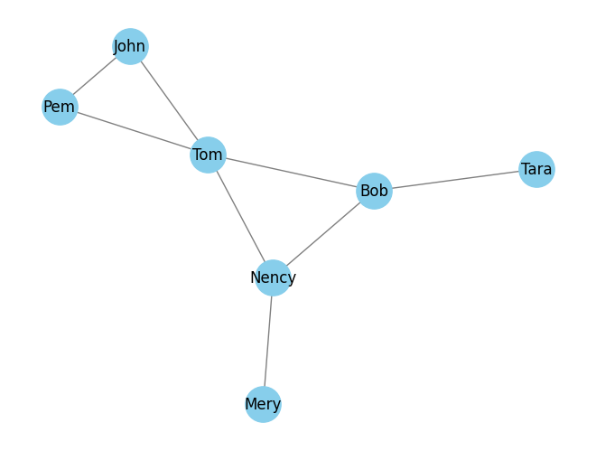
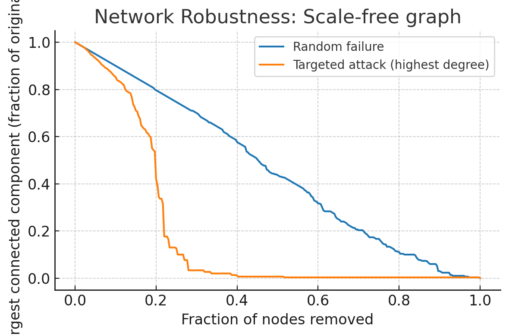

# 3.1 중심도 측도(중심도)

## 3.1.1 연결선 수(degree)

연결선 수(degree)는 소셜 네트워크의 중시도를 나타내는 매우 자연스러운 양이다.

네트워크의 **average degree**는 노드가 평균적으로 얼마나 연결되어 있는지를 나타낸다. 그러나 **average degree**는 실제 분포를 대표하기에 적합하지 않은 경우가 많다. 노드들이 매우 다양한 연결선 수를 갖는 경우가 그렇다.

## 3.1.2 근접도
노드의 중심도를 측정하는 또 다른 방법은 그 노드가 다른 노드와 얼마나 가까운지를 결정하는 것이다. 즉 한 노드의 중심도를 그 노드로부터 다른 노드까지의 모든 거리를 더해서 정하여 평균적으로 짧으면 그 합한 양이 작을 것이고, 노드의 중심도가 높다고 할 수 있다. 이를 근거로 **closeness centrality**(근접 중심도)를 정의할 수 있다.(한 노드에서 다른 모든 노드까지의 거리 합의 역수)

> $i$라는 노드의 **closeness centrality**는 다음과 같이 정의한다.
> $$\mathrm{g}_i = \frac{1}{\sum_{j \ne i}l_{ij}}$$
> 여기서 $l_{ij}$는 $i$에서 $j$까지의 거리이고, 노드 $i$ 자신을 제외한 네트워크의 모든 노드에 대해 더한다. **closeness centrality**에 대한 또 다른 공식으로 다음과 같이 $\mathrm{g}_i$에 $N-1$이라는 상수를 곱하는 방법이 있는데, 여기서 $N-1$은 분모에 더해지는 항의 개수를 의미한다.
> $$\tilde{\mathrm{g}}_i = (N - 1)\mathrm{g}_i = \frac{N-1}{\sum_{j \ne i}l_{ij}} = \frac{1}{\sum_{j \ne i}l_{ij} / (N - 1)}$$
> 이렇게 하면 네트워크의 크기에 의한 효과를 없앨 수 있어서 **closeness centrality** 값들을 여러 다른 네트워크에 걸쳐 비교할 수 있게 된다. 중요한 건 $\mathrm{g}_i$의 실제 값이 아니라 다른 노드들의 근접 중심도와 비교한 순위이기 때문에, 단순히 상수만 곱해진 상황에서 노드들의 상대적인 근접 중심도는 위와 동일하다. $\sum_{j \ne i}l_{ij} / (N - 1)$은 우리가 관심을 갖고 있는 노드 $i$로 부터 네트워크의 다른 부분들에 도돌하기 위한 **average distance**다. 따라서 **closeness**는 평균 거리의 역수와 같다.

## 3.1.3 betweenness centrality - 사이 중심도

네트워크에서 발생하는 많은 현상은 확산 과정을 바탕으로 한다. 이 확산 과정을 기반으로 하여 세번째 중심도인 **betweenness centrality**가 제안되었다.

가장 간단하고 널리 사용되는 정의는 어떤 노드를 통과하는 최단 경로의 수가 그 노드가 사용되는 빈도를 잘 추정 할 것으로 가정하는 것이다.

> 네트워크의 두 노드 사이에 길이가 같은 최단 경로가 둘 이상 있을 수 있다. 예를 들어, 노드 $X$와 $Y$가 서로 연결되어 있지 않지만 2개의 공통 이웃 $S, T$가 있는 경우 $X \to Y$로 이어지는 길이가 2인 2개의 각기 다른 최단 경로 $X-S-Y, X-T-Y$가 있다. $h \to j$ 의 총 $\sigma_{hj}$개의 최단 경로가 있고, 그 중에 노드 $i$를 지나는 경로 $\sigma_{hj}(i)$개가 있을 때 betweenness centrality는 다음과 같이 정의된다.
> $$b_i = \sum_{h \ne i\ne j}\frac{\sigma_{hj}(i)}{\sigma_{hj}}$$

어떤 노드가 네트워크에서 일어나는 통신에 있어 중요한 본부(station)와 같이 특별한 위치에 있다면 높은 betweenness centrality를 갖게 된다. (위의 그림에서 4번 node는 15의 betweenness centrality)를 가지고 있다. 네트워크에서 여러 지역을 연결하는 노드는 일반적으로 그 연결선 수가 적더라도 높은 사이 중심도를 가지고 있다. 

**betweenness centrality**개념은 링크로도 확장 가능하다. 임의의 링크의 사이 중심도는 그 링크를 통과 할 수 있는 가능한 모드 쌍 중 실제로 그 링크를 통과하는 최단 경로 수의 비율이다.

betweenness centrality가 매우 높은 링크는 종종 **community**(커뮤니티)라고 하는 네트워크의 결집된 영역들을 연결한다. 따라서 커뮤니티를 구분해서 찾기 위해 그러한 링크를 찾아내고 제거하는 데 사이 중심도를 사용하기도 한다. 

betweenness centrality는 네트워크의 크기에 따라 달라진다. 다양한 네트워크들 간의 노드 또는 링크의 사이 중심도를 비교하면, 사이 중심도 값을 정규화 해야 한다.

> 노드의 사이 중심도에서 노드 $i$를 통과할 수 있는 경로의 개수가 가질 수 있는 최댓값은 노드 $i$를 제외한 모든 노드 쌍의 수다. 이를 ${N - 1} \choose 2 = \frac{(N - 1)(N - 2)}{2}$와 같이 표현 할 수 있다. 노드 $i$의 betweenness centrality 를 정규화 하려면 betweenness centrality 값에 노드 $i$를 제외한 모든 노드 쌍의 수로 나누어 주면 된다.

# 3.2 중심도 분포

대규모 네트워크에서 여러 노드의 중심도가 어떻게 분포하는지 더 잘 이해하려면 통계적 분석을 해야 한다. 통계적 분석을 통해 네트워크의 단일 요소보다는 유사한 기능을 공유하는 노드와 링크의 종류에 주목할 수 있게 된다. 또한 분포 데이터의 분석은 네트워크 구성 요소의 불균일도를 보여준다. (e.g., 노드 연결선 수의 크기가 한 자리부터 수백만에 이르기까지 여러 자릿수에 걸쳐 있는 경우 그 네트워크의 degree는 매우 불균일한 것이다.)

degree 분포의 꼬리가 두껍다는 것은 degree 값들이 매우 불균일 하다는 뜻이다. 대다수의 노드들의 degree는 적고 큰 degree를 가진 소수의 노드(hub)는 네트워크에서 중요한 역할을 한다. 허브는 네트워크를 떠받치는 기둥이며 그 구조에서 일어나느 과정들을 조종한다. 

degree distribution의 넓이를 측정하는 한 가지 방법은 노드 간 degree의 다양성을 편균 연결선 수와 비교하는 **heterogenity parameter**(불균일도 매개변수)를 계산하는 것이다.

허브가 많을 수록 불균일도가 커진다. 불균일도는 네트워크 구조와 네트워크에서 벌어지는 동역학 과정에서 핵심적인 역할을 한다.

> 네트워크에서 degree distribution의 heterogentiy(불균일도) $\kappa$를 정식으로 정의하려면 degree 제곱의 평균인 **average squared degree**(평균 제곱 연결선 수), $\langle \kappa^2 \rangle$을 도입해야 한다.
> $$\langle \kappa^2 \rangle = \frac{k_1^2 + k_2^2 + \dots + k_N^2}{N} = \frac{\sum_ik_i^2}{N}$$
> 불균일도는 네트워크에서 평균 제곱 연결선 수를 평균 연결선 수($\langle k \rangle = d(N - 1)$)의 제곱으로 나눈 비율로 정의할 수 있다.
> $$\kappa = \frac{\langle k^2 \rangle}{\langle k \rangle^2}$$
> $k_0$라는 특정 값에서 뾰족한 봉우리(peek)가 있는 정규분포 또는 좁은 분포의 경우 연결선 수를 제곱한 값의 분포는 $k_0^2$ 근처에 몰려 있을 것이다. 따라서 $\langle k_0^2 \rangle \approx k_0^2$이 되고 $\langle k \rangle \approx k_0, \ \kappa \approx 1$이 된다. 평균 연결선 수가 $k_0$로 같은 두꺼운 꼬리를 가진 분포의 경우 $\langle k^2 \rangle$은 허브의 많은 연결선 수 때문에 폭발적으로 증가하게 되고 $\kappa \gg 1$이 된다.

네트워크에 방향성이 있을 경우 in-degree와 out-degree를 모두 고려해야한다. 

# 3.3 친구의 역설

어떤 사람이 친구가 많으면 친구가 별로 없는 사람에 비해 언급될 확률 더 높다. 즉, **누군가의 친구에게 연락한다는 건 실제로는 노드가 아니라 링크를 선택하는 것이다** 임의의 노드로 가장 친구가 많은 친구를 찾는 것은 단순히 $1/N$으로 임의의 노드를 선택하는 것이지만 링크를 선택한다면 노드와 연결된 연결선 수가 많을 수록 선택될 확률이 높아지는 것이다.

링크를 선택하는 것과 노드를 선택하는 것의 차이에는 또 다른 독특한 의미가 있다. 위의 네트워크에서 Nency를 선택했을 때, Nency는 총 Bob, Mery, Tom 이라는 세명의 친구가 있다. 그 친구들은 총 $3 + 1 + 4 = 8$명의 친구가 있으므로 Nency의 친구들은 평균적으로 $\frac{8}{3}$명의 친구가 있다. 다른 모든 노드도 마찬가지의 계산을 하면 노드들 이웃의 평균 이웃 수가 $\frac{17}{6} = 2.83$이라는 사실을 알 수 있다.

$$
\frac{3.00 + 2.67 + 2.50 + 2.67 + 3.00 + 3.00 + 3.00}{7}
= \frac{17}{6} \approx 2.83
$$

friendship paradox(노드의 평균 이웃 수 < 노드의 이웃의 평균 이웃 수)의 원인은 **random sampling**(임의추출)때문이다. 네트워크의 average degree를 계산 할 때는 균일하게, 이웃의 average degree를 계산 할 때는 degree 수에 비례해 표본을 추출하게 된다.

degree의 분포가 넓을 수록(꼬리가 두꺼울 수록) friendship paradox는 강해진다. 반면에 모든 노드의 degree가 유사할 경우 $\langle d \rangle$는 이웃의 average degree와 유사해 진다.

# 3.5 견고성(robustness)

시스템의 일부 구성요소에 오류가 생겨도 기능에 영향을 미치지 않는 경우, 해당 시스템이 **robust**견고하다고 표현한다.

예를 들어 어떤 노드하나를 제거 했을 때, 그 네트워크의 구조와 기능이 어떻게 변할지에 대한 질문을 할 수 있다.

네트워크의 **connectedness**(연결성)은 해당 네트워크의 기능에 영향을 미치는 중요한 특성이다. 따라서 네트워크의 **robustness**를 정의하고 측정하는 한 가지 방법은 어떤 노드와 그 노드에 붙은 링크들의 소실이 시스템의 전체적 연결성에 어떤 영향을 미치는지 관찰하는 것이다.

**만일 네트워크가 서로 연결이 끊어진 부부들로 쪼개진다면** 이 쪼개짐은 네트워크의 기능을 위협할 수 있는 심각한 손상이 발생했다는 뜻일 수 있다.

degree 가 큰 노드를 제거 대상으로 하는 것은 중심도가 높은 노드를 제거해 피해를 최대화하기 위한 **attack**의 예다. 많은 실제 네트워크에는 중심도가 높은 허브들이 있어서 무작위 오류나 고장에 대해서는 매우 견고하지만 의도적인 공격에는 매우 취약하다는 것을 결론 지을 수 있다.

# 3.6 코어 분해

큰 네트워크를 분석하거나 시각화할 때는 대체로 더 조밀한 부분에 집중하는 것이 유용하다.

> k-core decomposition(k 코어 분해)
> 처음에 $k=0$에서 시작해서 $k$값을 늘려가며 shell을 제거하는 과정을 반복한다. 
>
> 1. 연결선 수가 $k$인 모든 노드를 더이상 조건에 맞는(degree가 $k$인) 노드가 남아 있지 않을 때까지 재귀적으로 제거한다.
> 2. 제거된 노드들이 $k-shell$을 이루는 것이고, 남은 노드는 모두 $k + 1$이상의 degree를 갖기 때문에 $k+ 1$ core를 이룬다.
> 3. 코어에 노드가 더 이상 없으면 종료한다. 아직 노드가 남아 있다면 $k$를 증가시켜서 다시 1번 과정을 반복한다.

